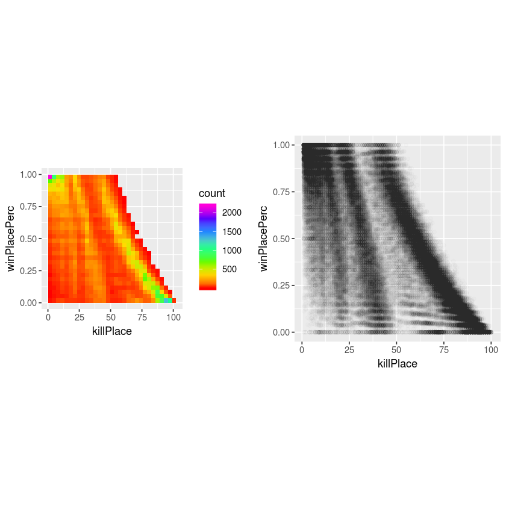

```R
library(tidyverse)
pubg <- read_csv("train.csv")
small = pubg[1:100000,]

#Adding small to visualize small data
```


```R
#Data visualization 
#win percentage vs all variables

grid.arrange(
    ggplot(data = small) +
        geom_bin2d(mapping = aes(x = walkDistance, y = winPlacePerc)) +
        theme(aspect.ratio=1)+scale_fill_gradientn(colours=rainbow(7)),
    ggplot(data = small) + 
        geom_point(mapping = aes(x = walkDistance, y = winPlacePerc), alpha = 1 / 100)+theme(aspect.ratio=1),
    ncol=2)

grid.arrange(
    ggplot(data = filter(small, damageDealt<1000)) +
        geom_bin2d(mapping = aes(x = damageDealt, y = winPlacePerc)) +
        theme(aspect.ratio=1)+scale_fill_gradientn(colours=rainbow(7)),
    ggplot(data = filter(small, damageDealt<1000)) + 
        geom_point(mapping = aes(x = damageDealt, y = winPlacePerc), alpha = 1 / 100)+theme(aspect.ratio=1),
    ncol=2)
    
grid.arrange(
    ggplot(data = small) +
        geom_bin2d(mapping = aes(x = headshotKills, y = winPlacePerc)) +
        theme(aspect.ratio=1)+scale_fill_gradientn(colours=rainbow(7)),
    ggplot(data = small) + 
        geom_point(mapping = aes(x = headshotKills, y = winPlacePerc), alpha = 1 / 100)+theme(aspect.ratio=1),
    ncol=2)
    
grid.arrange(
    ggplot(data = small) +
        geom_bin2d(mapping = aes(x = heals, y = winPlacePerc)) +
        theme(aspect.ratio=1)+scale_fill_gradientn(colours=rainbow(7)),
    ggplot(data = small) + 
        geom_point(mapping = aes(x = heals, y = winPlacePerc), alpha = 1 / 100)+theme(aspect.ratio=1), 
    ncol=2)
    
grid.arrange(
    ggplot(data = small) +
        geom_bin2d(mapping = aes(x = winPoints, y = winPlacePerc)) +
        theme(aspect.ratio=1)+scale_fill_gradientn(colours=rainbow(7)),
    ggplot(data = small) + 
        geom_point(mapping = aes(x = winPoints, y = winPlacePerc), alpha = 1 / 100)+theme(aspect.ratio=1), 
    ncol=2)
    
grid.arrange(
    ggplot(data = small) +
        geom_bin2d(mapping = aes(x = boosts, y = winPlacePerc)) +
        theme(aspect.ratio=1)+scale_fill_gradientn(colours=rainbow(7)),
    ggplot(data = small) + 
        geom_point(mapping = aes(x = boosts, y = winPlacePerc), alpha = 1 / 100)+theme(aspect.ratio=1), 
    ncol=2)
    
grid.arrange(
    ggplot(data = small) +
        geom_bin2d(mapping = aes(x = assists, y = winPlacePerc)) +
        theme(aspect.ratio=1)+scale_fill_gradientn(colours=rainbow(7)),
    ggplot(data = small) + 
        geom_point(mapping = aes(x = assists, y = winPlacePerc), alpha = 1 / 100)+theme(aspect.ratio=1), 
    ncol=2)
    
grid.arrange(
    ggplot(data = small) +
        geom_bin2d(mapping = aes(x = DBNOs, y = winPlacePerc)) +
        theme(aspect.ratio=1)+scale_fill_gradientn(colours=rainbow(7)),
    ggplot(data = small) + 
        geom_point(mapping = aes(x = DBNOs, y = winPlacePerc), alpha = 1 / 100)+theme(aspect.ratio=1), 
    ncol=2)
    
grid.arrange(
    ggplot(data = small) +
        geom_bin2d(mapping = aes(x = killPlace, y = winPlacePerc)) +
        theme(aspect.ratio=1)+scale_fill_gradientn(colours=rainbow(7)),
    ggplot(data = small) + 
        geom_point(mapping = aes(x = killPlace, y = winPlacePerc), alpha = 1 / 100)+theme(aspect.ratio=1), 
    ncol=2)
    
grid.arrange(
    ggplot(data = small) +
        geom_bin2d(mapping = aes(x = killPoints, y = winPlacePerc)) +
        theme(aspect.ratio=1)+scale_fill_gradientn(colours=rainbow(7)),
    ggplot(data = small) + 
        geom_point(mapping = aes(x = killPoints, y = winPlacePerc), alpha = 1 / 100)+theme(aspect.ratio=1), 
    ncol=2)
    
grid.arrange(   
    ggplot(data = small) +
        geom_bin2d(mapping = aes(x = killStreaks, y = winPlacePerc)) +
        theme(aspect.ratio=1)+scale_fill_gradientn(colours=rainbow(7)),
    ggplot(data = small) + 
        geom_point(mapping = aes(x = killStreaks, y = winPlacePerc), alpha = 1 / 100)+theme(aspect.ratio=1),
    ncol=2)
    
grid.arrange(
    ggplot(data = small) +
        geom_bin2d(mapping = aes(x = kills, y = winPlacePerc)) +
        theme(aspect.ratio=1)+scale_fill_gradientn(colours=rainbow(7)),
    ggplot(data = small) + 
        geom_point(mapping = aes(x = kills, y = winPlacePerc), alpha = 1 / 100)+theme(aspect.ratio=1),
    ncol=2)
    
grid.arrange(
    ggplot(data = small) +
        geom_bin2d(mapping = aes(x = longestKill, y = winPlacePerc)) +
        theme(aspect.ratio=1)+scale_fill_gradientn(colours=rainbow(7)),
    ggplot(data = small) + 
        geom_point(mapping = aes(x = longestKill, y = winPlacePerc), alpha = 1 / 100)+theme(aspect.ratio=1),
    ncol=2)
    
grid.arrange(
    ggplot(data = small) +
        geom_bin2d(mapping = aes(x = revives, y = winPlacePerc)) +
        theme(aspect.ratio=1)+scale_fill_gradientn(colours=rainbow(7)),
    ggplot(data = small) + 
        geom_point(mapping = aes(x = revives, y = winPlacePerc), alpha = 1 / 100)+theme(aspect.ratio=1),
    ncol=2)
    
grid.arrange(
    ggplot(data = small) +
        geom_bin2d(mapping = aes(x = roadKills, y = winPlacePerc)) +
        theme(aspect.ratio=1)+scale_fill_gradientn(colours=rainbow(7)),
    ggplot(data = small) + 
        geom_point(mapping = aes(x = roadKills, y = winPlacePerc), alpha = 1 / 100)+theme(aspect.ratio=1),
    ncol=2)
    
grid.arrange(
    ggplot(data = small) +
        geom_bin2d(mapping = aes(x = swimDistance, y = winPlacePerc)) +
        theme(aspect.ratio=1)+scale_fill_gradientn(colours=rainbow(7)),
    ggplot(data = small) + 
        geom_point(mapping = aes(x = swimDistance, y = winPlacePerc), alpha = 1 / 100)+theme(aspect.ratio=1),
    ncol=2)
    
grid.arrange(
    ggplot(data = small) +
        geom_bin2d(mapping = aes(x = teamKills, y = winPlacePerc)) +
        theme(aspect.ratio=1)+scale_fill_gradientn(colours=rainbow(7)),
    ggplot(data = small) + 
        geom_point(mapping = aes(x = teamKills, y = winPlacePerc), alpha = 1 / 100)+theme(aspect.ratio=1),
    ncol=2)
    
grid.arrange(
    ggplot(data = small) +
        geom_bin2d(mapping = aes(x = vehicleDestroys, y = winPlacePerc)) +
        theme(aspect.ratio=1)+scale_fill_gradientn(colours=rainbow(7)),
    ggplot(data = small) + 
        geom_point(mapping = aes(x = vehicleDestroys, y = winPlacePerc), alpha = 1 / 100)+theme(aspect.ratio=1),
    ncol=2)
    
grid.arrange(
    ggplot(data = small) +
        geom_bin2d(mapping = aes(x = weaponsAcquired, y = winPlacePerc)) +
        theme(aspect.ratio=1)+scale_fill_gradientn(colours=rainbow(7)),
    ggplot(data = small) + 
        geom_point(mapping = aes(x = weaponsAcquired, y = winPlacePerc), alpha = 1 / 100)+theme(aspect.ratio=1),
    ncol=2)
    
grid.arrange(
    ggplot(data = small) +
        geom_bin2d(mapping = aes(x = numGroups, y = winPlacePerc)) +
        theme(aspect.ratio=1)+scale_fill_gradientn(colours=rainbow(7)),
    ggplot(data = small) + 
        geom_point(mapping = aes(x = numGroups, y = winPlacePerc), alpha = 1 / 100)+theme(aspect.ratio=1),
    ncol=2)
    
grid.arrange(
    ggplot(data = small) +
        geom_bin2d(mapping = aes(x = maxPlace, y = winPlacePerc)) +
        theme(aspect.ratio=1)+scale_fill_gradientn(colours=rainbow(7)),
    ggplot(data = small) + 
        geom_point(mapping = aes(x = maxPlace, y = winPlacePerc), alpha = 1 / 100)+theme(aspect.ratio=1),
    ncol=2)
    
grid.arrange(
    ggplot(data = small) +
        geom_bin2d(mapping = aes(x = maxPlace, y = rideDistance)) +
        theme(aspect.ratio=1)+scale_fill_gradientn(colours=rainbow(7)),
    ggplot(data = small) + 
        geom_point(mapping = aes(x = maxPlace, y = rideDistance), alpha = 1 / 100)+theme(aspect.ratio=1),
    ncol=2)

```





